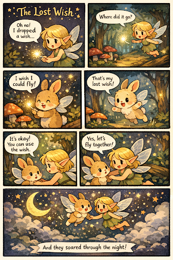

# Week 4 Comic & Storytelling

## The Artifact

A short 5 to 6 panel cute fairy-style comic. Story about a small fairy who loses a magical wish in an enchanted forest, a bunny finds it, and they share the magic together. Soft pastel colors, magical glowing lights, simple and easy-to-understand story, storybook illustration style, expressive characters, warm and wholesome mood

## Commentary 
In this assignment, I used AI to create a short comic about a fairy who loses a wish and a bunny who accidentally finds it. The story focuses on kindness and sharing, since the fairy chooses to let the bunny use the wish instead of taking it back. My goal was to make a simple, cute story with a clear message that happiness grows when people share what they have. The comic form helps show this meaning through stages: losing the wish, searching, discovering, and resolving the problem.

Using AI to make the comic helped me turn my ideas into visuals quickly and focus more on storytelling instead of drawing skills. The comic format allowed me to show emotions, actions, and changes across panels, while AI helped generate the magical world and characters. This made me think about how creativity can come from guiding technology rather than creating everything by hand.

This project showed me that making a comic with AI is a collaboration between human ideas and machine generation. I decided the characters, theme, and story structure, while the AI generated the visual style, settings, and character designs based on my prompts. The AI was good at quickly producing magical images, but it often followed common fantasy patterns like glowing lights and cute characters. Because of this, I had to guide the process carefully to make sure the story reflected my intention instead of just accepting what the AI produced. 

Personally, using AI to make a comic felt both exciting and strange. It made the process faster and easier, but sometimes the images did not fully match what I imagined, so I had to revise prompts and make decisions about what to keep or change. The comic feels creative, but it also raises questions about authorship because the visuals are not fully “handmade.” This made me realize that AI can help create art, but human direction is still necessary to give the work meaning.

## Process Notes
**How did you make this?**  
I created the comic by first thinking of a simple story idea that could be communicated clearly in a few panels. I wanted something cute and easy to follow, so I chose a fairy and a bunny in a magical forest. After deciding the basic plot (lost wish → discovery → sharing), I used an AI image generator to produce a 5 to 6 panel comic that visually showed these moments.

**What tools did you use?**  
I used an AI image generation tool to create the comic panels and VS Code/Markdown to organize the assignment and reflection.

**What decisions did you make?**  
I decided the characters, the emotional message of the story, and the sequence of panels. I also chose which generated images best matched the story. When the AI outputs didn't perfectly match my idea, I adjusted the prompt and selected the version that communicated the narrative most clearly.

## Reflection
**Is AI a collaborator, tool, or plagiarist in storytelling?**

From this exercise, I see AI as both a tool and a collaborator, but not really a plagiarist on its own. When making the comic, AI helped me generate the visuals quickly, especially since I don't have strong drawing skills. In that way, it worked like a tool that followed my prompts. At the same time, some of the images and details surprised me and influenced how I shaped the story, which made it feel like a collaborator in the creative process.

However, AI does not create meaning by itself. It generates patterns based on existing data, so I still had to decide the story, message, and final choices. Without human guidance, the comic could feel generic or not reflect my intention. This made me realize that storytelling still depends on human judgment and interpretation.

## Attribution & AI Use
**Tools used:**  
AI image generation tool, Markdown/VS Code for writing and formatting.

**AI prompts (summary):**  
Prompted the AI to create a short 5 to 6 panel comic about a fairy who loses a magical wish in a forest and a bunny who finds it, with a cute, magical, storybook style.

**What AI generated:**  
The visual comic panels, character designs, and magical environment.

**What you changed or decided:**  The story concept, theme (kindness and sharing), panel sequence, and which generated images to include in the final comic.
