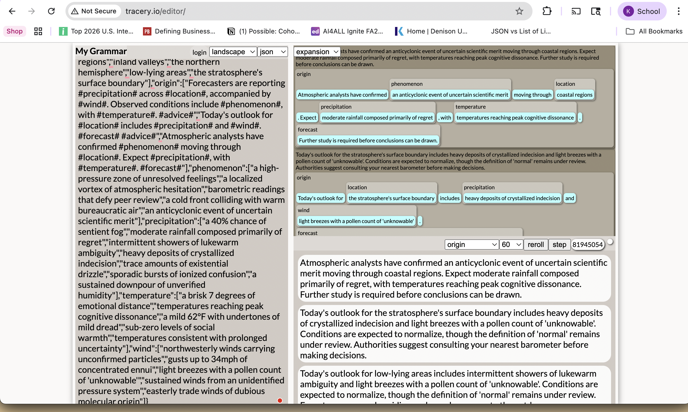

# Week 9 – Bots & Generators

## The Generator

*Figure 1. I used Tracery grammar JSON and put in the text about absurd weather reports*

## The Curation Challenge
I picked the best 7 outputs. Here are they: 

1)  "Atmospheric analysts have confirmed barometric readings that defy peer review moving through the stratosphere's surface boundary. Expect a 40% chance of sentient fog, with a brisk 7 degrees of emotional distance. Further study is required before conclusions can be drawn."

Why: "Defy peer review" and "further study is required" are pitch-perfect scientific hedging. "Emotional distance" measured in degrees is the sharpest psychological-meets-meteorological collision in the whole set.

2)  "Atmospheric analysts have confirmed a high-pressure zone of unresolved feelings moving through downtown. Expect heavy deposits of crystallized indecision, with temperatures reaching peak cognitive dissonance. Meteorologists project an anticyclonic event of uncertain scientific merit persisting through the weekend."

Why: Three different psychological concepts stack on top of each other without repeating — unresolved feelings, indecision, cognitive dissonance — and the scientific framing never breaks. Feels like a real forecast.

3) "Forecasters are reporting moderate rainfall composed primarily of regret across the northern hemisphere, accompanied by gusts up to 34mph of concentrated ennui. Observed conditions include a high-pressure zone of unresolved feelings, with temperatures reaching peak cognitive dissonance. Authorities suggest consulting your nearest barometer before making decisions."

Why: "34mph of concentrated ennui" is the single funniest measurement in the set. The advice at the end — consult your barometer — lands as deadpan comedy because it treats everything before it as routine.

4) "Today's outlook for the stratosphere's surface boundary includes heavy deposits of crystallized indecision and gusts up to 34mph of concentrated ennui. Further study is required before conclusions can be drawn. Citizens should wear layers and maintain a healthy skepticism."

Why: "Maintain a healthy skepticism" as weather safety advice is the best closing line generated. It works both as absurdist humor and, accidentally, as genuine epistemological advice.

5) "Atmospheric analysts have confirmed a cold front colliding with warm bureaucratic air moving through the eastern seaboard. Expect a 40% chance of sentient fog, with temperatures consistent with prolonged uncertainty. Further study is required before conclusions can be drawn."

Why: "Warm bureaucratic air" is the most original combination the grammar produced — it's not purely emotional, it's institutional, which adds a different register entirely. "Sentient fog" alongside it creates a genuinely strange world.

6) "Forecasters are reporting a sustained downpour of unverified humidity across the eastern seaboard, accompanied by northwesterly winds carrying unconfirmed particles. Observed conditions include a high-pressure zone of unresolved feelings, with temperatures reaching peak cognitive dissonance. Residents are advised to remain indoors and hydrate accordingly."

Why: "Unverified humidity" and "unconfirmed particles" make this the most scientifically paranoid entry — it reads like a report from an agency that trusts nothing. "Hydrate accordingly" is the perfect mundane ending.

7) "Atmospheric analysts have confirmed a localized vortex of atmospheric hesitation moving through downtown. Expect trace amounts of existential drizzle, with sub-zero levels of social warmth. Conditions are expected to normalize, though the definition of 'normal' remains under review."

Why: "Atmospheric hesitation" and "existential drizzle" are the most poetic combination generated. "The definition of 'normal' remains under review" elevates the whole thing — it sounds like a footnote in a government document about reality itself.

## Process document 
For this project I built a text generator using Tracery, a grammar-based generation tool that works by defining symbols - categories of words or phrases - and combining them randomly according to rules. I started by designing the concept: absurd weather reports written in a weirdly scientific register, where meteorological language collides with emotional and psychological vocabulary.

The grammar I constructed contained 10 symbols: location, precipitation, temperature, wind, phenomenon, advice, forecast, and three variations of an "origin" sentence structure that served as the output template. Each symbol held between 5 and 8 options, giving the system a wide combinatorial range. The parameters I controlled were entirely lexical — I chose every word and phrase that could appear, which meant the system's personality was determined before a single output was generated. I made decisions about tone (clinical, hedging, bureaucratic), about which emotional concepts to treat as measurable weather phenomena (ennui, regret, cognitive dissonance, social warmth), and about how advice lines should close each report.

Getting the grammar running required some troubleshooting — pasting the JSON into Tracery produced a few errors I had to identify and fix before outputs began generating correctly. Once it was working, I generated outputs by clicking the generate button repeatedly, copying results as I went. 

In total I generated over 60 outputs.
Repetition became noticeable fairly quickly. Certain combinations — particularly "moderate rainfall composed primarily of regret" and "gusts up to 34mph of concentrated ennui" — appeared frequently enough that I began to see the seams of the system. This was useful: it revealed which phrases were statistically dominant and made the curation process partly about finding outputs where those familiar elements landed in fresh combinations rather than tired ones.

## Artist Statement
The question this assignment asks — what is creativity when machines can generate endlessly — turned out to be less abstract than I expected. I felt it concretely, sitting there clicking generate for the sixtieth time, watching the system produce another plausible-sounding weather report about crystallized indecision moving through the eastern seaboard. At some point the generation stopped feeling exciting and started feeling like obligation. That exhaustion was informative. It suggested that creativity is not about volume — it never was — and that infinite possibility is not the same thing as infinite meaning.

The creative work in this project was genuinely shared between me and the system, but unevenly distributed across different stages. I made the decisions that gave the generator its personality: which emotional concepts to treat as measurable phenomena, which scientific phrases carry the right tone of bureaucratic hedging, how advice lines should land. Those choices happened before the first output was generated. What the system contributed was combinatorial surprise — pairings I would not have constructed deliberately, like "warm bureaucratic air" colliding with "sentient fog," or "a healthy skepticism" appearing as safety advice. I authored the vocabulary; the machine authored the specific collisions.

But the moment I felt most clearly like a human making creative decisions was curation. Choosing which seven reports to keep — and being able to say precisely why each one worked — required aesthetic judgment the system cannot perform. The machine cannot know that "the definition of normal remains under review" is funnier and stranger than "residents are advised to remain indoors." I know that, and knowing it is the human contribution that no grammar rule can encode.
Curation, it turns out, is where creativity lives in generative work.

## Process Notes
How did you make this?
I built a text generator using Tracery (tracery.io), a grammar-based 
generation tool that constructs sentences by randomly combining 
predefined word lists. I designed the grammar around the concept of 
absurd weather reports written in a weirdly scientific register, where 
meteorological language collides with emotional and psychological 
vocabulary.

I wrote all 10+ grammar symbols myself, choosing which emotional 
concepts to treat as measurable weather phenomena (ennui, regret, 
cognitive dissonance, social warmth), which scientific phrases would 
carry the right tone of bureaucratic hedging, and how each report 
should close. I also decided when to stop generating (after 60+ 
outputs) and which 7 reports to curate from the full set.

## Reflection
Creativity, I found, is not about volume. The generator could have 
run forever - and that was the problem. Sitting there clicking 
generate for the sixtieth time, watching the system produce another 
report about crystallized indecision moving through the eastern 
seaboard, the process stopped feeling exciting and started feeling 
exhausting. Infinite possibility is not the same thing as infinite 
meaning.

The human in this project was present at every stage, but differently 
at each one. Before generation, I was a designer — I chose every word 
and phrase the system could draw from, which meant the generator's 
personality was entirely mine before a single output appeared. During 
generation, I was more of a witness, watching the system find 
combinations I wouldn't have constructed deliberately. After 
generation, I was an editor — and that is where I felt most clearly 
in control. Choosing which outputs to keep, and being able to say 
precisely why each one worked, required aesthetic judgment the system 
cannot perform.

Was I in control of the output? Partially. I controlled the 
vocabulary and the rules, but not the specific combinations. The 
machine surprised me — "warm bureaucratic air" colliding with 
"sentient fog" was not something I planned. But I decided it was 
good. That decision — recognizing value in something the system 
produced accidentally — is where the human in generative work lives.

## Attribution & AI Use
- Tools used: Tracery (tracery.io), ChatGPT 
- AI prompts (summary): I used ChatGPT to explain the terms and generate the word lists for me
- What AI generated: The analysis. Besides that, all grammar rules, word lists, and curation decisions were made independently
- What you changed or decided: Concept, grammar 
  symbols, word choices, curation criteria, and written reflections
