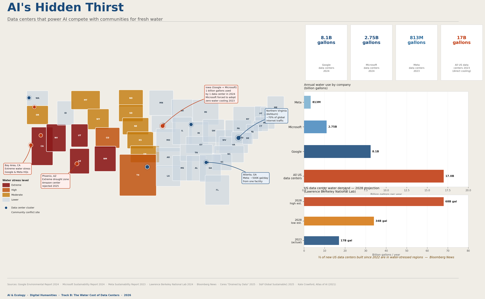

# Week 12 – AI & Ecology

## The Artifact

*Figure 1. I used Canva to make an infographic about map and water usage data*

## My Research - The hidden thirst
I researched one of the least visible environmental costs of artificial intelligence: water. AI data centers require massive amounts of water to cool the servers that run every query, every image generation, every chatbot response. Unlike carbon emissions, water consumption is local — it is drawn from specific rivers, aquifers, and municipal supplies, putting it in direct competition with drinking water, agriculture, and ecosystems.

The most striking case study I found was in West Des Moines, Iowa. In 2023, city officials told Microsoft it could not build a sixth data center until it committed to significantly reducing peak water usage. Microsoft eventually pledged zero-water cooling systems for all new facilities designed after August 2024 — but only after community and government pressure forced the issue. The technology was available; it required political will to deploy it.

> A single Google data center in Council Bluffs, Iowa consumed 1 billion gallons of water in 2024 — enough to supply all of Iowa's residential water for five days. 
> 
> — *Fast Company / The Current, citing Google Environmental Report 2024*

The hardest data to find was consistent per-query water use. Numbers range from 0.32 ml (OpenAI's direct cooling figure) to 10–50 ml per prompt when indirect water — the water used to generate the electricity powering the servers — is included. That is a 100-fold difference depending on what is counted. The uncertainty reflects both genuine methodological disagreement and the fact that most companies are not required to disclose facility-level water data.

What surprised me most was that inference — every ordinary query — contributes to this water cost continuously, not just during one-time model training. Twenty everyday prompts could equal half a liter of water. Scaled to hundreds of millions of daily users, that becomes tens of millions of gallons per day globally, and that is only the directly measurable fraction.

## Data Sources - Where the numbers come from 
1. Google Environmental Report 2024. gstatic.com/gumdrop/sustainability/google-2024-environmental-report.pdf — Primary source for Google's 8.1B gallon figure and Council Bluffs data.

2. Microsoft Sustainability Report 2024. microsoft.com/corporate-responsibility/sustainability — Primary source for Microsoft's 2.75B gallon figure and Iowa commitments.

3. Meta Sustainability Report 2023. sustainability.atmeta.com/2024-sustainability-report/ — Primary source for Meta's 813M gallon figure.

4. Li, P., Yang, J., Islam, M.A., and Ren, S. (2023). "Making AI Less Thirsty: Uncovering and Addressing the Secret Water Footprint of AI Models." UC Riverside / UT Arlington. Later expanded in Communications of the ACM, 2025. — Per-query water use estimates (10–50 ml range).

5. Lawrence Berkeley National Laboratory (2024). 2024 Report on U.S. Data Center Energy Use. — 17B gallon baseline and 2028 projections.

6. Axios Des Moines (Sept. 2023). "Microsoft's AI epicenter is an Iowa water hog." — Iowa water ultimatum story.

7. Iowa Public Radio / Midwest Newsroom (July 2025). "From water to policing, Midwest cities take on AI with few guardrails." — Microsoft zero-water cooling commitment details.

8. Crawford, K. (2021). Atlas of AI: Power, Politics, and the Planetary Costs of Artificial Intelligence. Yale University Press. — Theoretical framework for understanding AI's material costs.

## Personal Reflection
### How I use AI
I use AI tools regularly — for drafting, research, brainstorming, and coding assistance. Before this project, I thought of these tools as essentially weightless: software running on distant servers, invisible and free of the friction of physical resources. This project revealed that framing as a kind of designed ignorance. The "cloud" is not weightless. It is a network of physical machines in physical buildings drawing from physical water supplies in specific places, affecting specific communities.

### Estimated impact
Using the UC Riverside research range of 10–50 ml per prompt as a guide, on a typical day I might send 15–30 prompts across various AI tools. That is 150 ml to 1.5 liters of water per day — somewhere between a glass and a large bottle. Over a year, that is 55 to 540 liters from my use alone. The range is wide because the actual number depends entirely on which data center handles my request and how it is cooled — information I have no access to.

### What I'm willing to change
I am willing to be more intentional about when I use generative AI — choosing it for tasks where it genuinely improves the outcome rather than as a first reflex for anything requiring writing or search. I am also willing to advocate: asking tech companies to publish facility-level water data, supporting transparency legislation, and understanding that the Iowa story shows community pressure can work.

### What I can't or won't change — and why
I will not stop using AI tools entirely. They are embedded in the tools my school and workplace use, and opting out individually would not meaningfully reduce data center demand. More importantly, the scale mismatch is stark: a single corporate decision to switch from evaporative to air cooling at one data center saves more water than a million individual users cutting their daily prompts in half. Individual reduction is not nothing — but it cannot substitute for infrastructure-level change.

## Systemic vs. Individual

| What individuals can do | What requires systemic change |
|------------------------|------------------------------|
| Be intentional about AI use — not every task needs it | Mandatory facility-level water reporting for all data centers |
| Support companies with stronger disclosure practices | Water-use caps tied to expansion permits |
| Advocate for transparency legislation locally | Requirements for zero-water or closed-loop cooling in drought regions |
| Vote in local elections where data center water permits are decided | Community benefit agreements before data centers can draw water |
| Understand and talk about the material costs of "the cloud" | EU-style disclosure rules adopted globally (EU EED 2023/1791 is a start) |

### Who is responsible?
Kate Crawford's Atlas of AI argues that AI's environmental costs are not accidents — they are structural outcomes of an industry that externalizes its resource costs onto ecosystems and marginalized communities while concentrating its profits in wealthy regions. That framing helps clarify responsibility: the primary obligation rests with the companies building and operating the infrastructure, and with the regulators who set the rules.

The Iowa case is instructive precisely because it shows what happens when local government pushes back: Microsoft adopted zero-water cooling — technology that already existed — only when expansion was made conditional on it. The change required: informed local officials, a formal agreement with legal teeth, and community awareness. None of that is individual consumer behavior.

> "AI requires continuous extraction — of minerals, energy, and water. The benefits are concentrated in wealthy regions. The costs are borne by ecosystems and marginalized communities." 
> 
> — *Kate Crawford, Atlas of AI (2021)*

This does not mean individuals are off the hook — awareness matters, and consumer pressure does shift corporate behavior. But holding individuals responsible for systemic infrastructure decisions is a form of misdirection that has historically served extractive industries well. The honest answer to "who is responsible?" is: companies first, regulators second, and informed citizens as the mechanism of pressure on both.

## Attribution & AI Use

- Tools used:
  ChatGPT

- AI prompts (summary):
  I asked Claude to help plan Track B, find and verify data on
  corporate water use and the Iowa conflict, build visualizations,
  and draft all written deliverables.

- What AI generated:
  The interactive visualization, PNG infographic map, research
  documentation, sustainability web page, artist statement, and
  course reflection. Data points were verified through live web
  searches during our session.

- What you changed or decided:
  I chose Track B and the water focus. I provided the initial data
  I found and identified the key personal insight — that every
  prompt consumes water, not just model training — which shaped
  the reflection. I chose the PNG format over web-only output and
  decided to frame personal responsibility as civic action rather
  than individual reduction.
